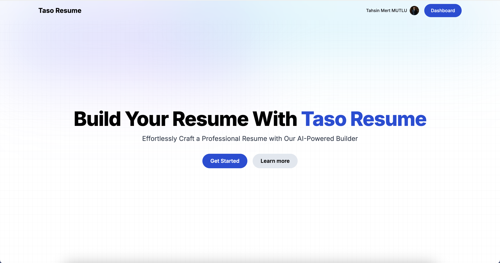
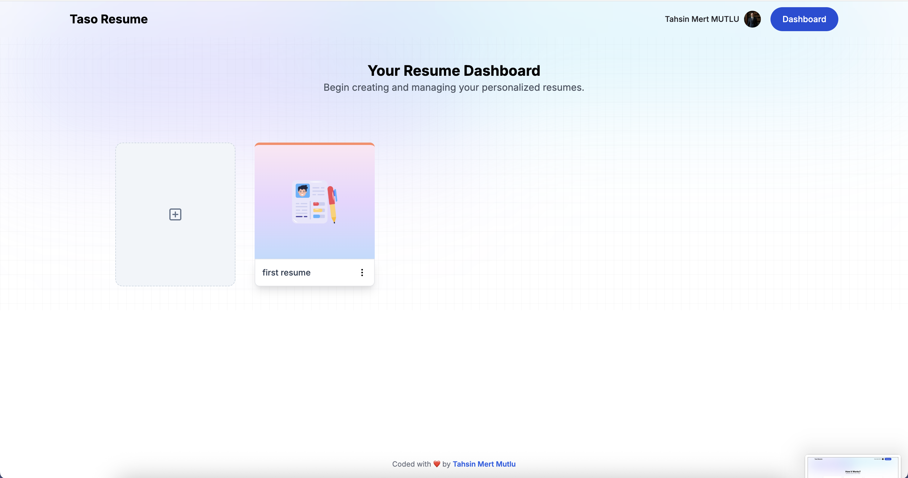
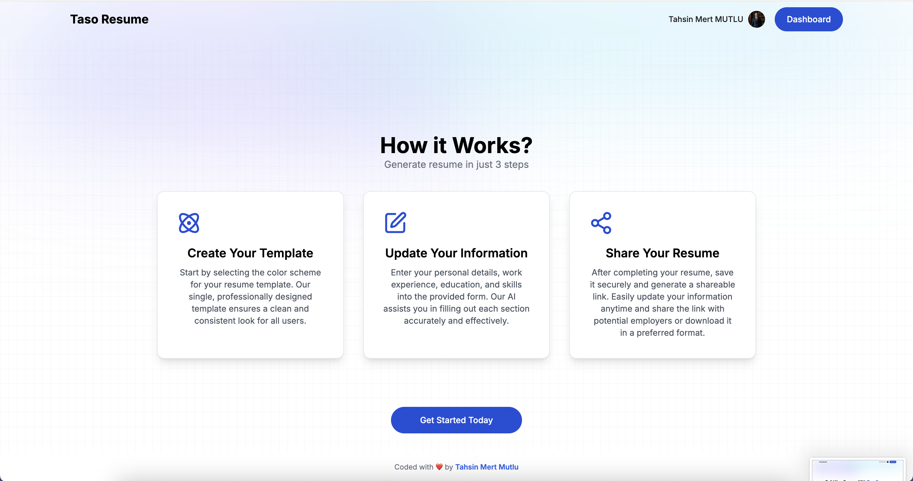

# Taso Resume 🚀

Merhaba! Bu proje AI destekli bir özgeçmiş (resume) oluşturma uygulaması. Next.js ile yaptım ve kullanması çok kolay!



## Ne İşe Yarar?

Bu uygulama sayesinde:
- Profesyonel özgeçmişler oluşturabilirsin
- AI ile özgeçmiş içeriğini geliştirebilirsin
- Özgeçmişini paylaşılabilir link olarak paylaşabilirsin
- Birden fazla özgeçmiş oluşturup yönetebilirsin

## Kurulum

### 1. Projeyi İndir

```bash
git clone [repo-url]
cd HireLogic
```

### 2. Paketleri Yükle

```bash
npm install
```

### 3. Environment Variables Ayarla

Proje klasöründe `.env` dosyası oluştur ve şunları ekle:

```env
# MongoDB bağlantısı
MONGODB_URL=mongodb://localhost:27017/tasoresume

# Clerk Authentication (ücretsiz hesap açabilirsin clerk.com'dan)
NEXT_PUBLIC_CLERK_PUBLISHABLE_KEY=pk_test_...
CLERK_SECRET_KEY=sk_test_...

# Google Gemini API (AI için - Google AI Studio'dan alabilirsin)
GOOGLE_GENERATIVE_AI_API_KEY=your-api-key-here

# Ollama (opsiyonel - eğer local AI kullanmak istersen)
OLLAMA_API_URL=http://localhost:11434
OLLAMA_MODEL=llama3.1:8b
```

**Not:** MongoDB'yi local olarak çalıştırman gerekiyor. Eğer yoksa MongoDB Atlas'tan ücretsiz hesap açabilirsin.

### 4. MongoDB'yi Başlat

Eğer local MongoDB kullanıyorsan:

```bash
# macOS için (Homebrew ile)
brew services start mongodb-community

# veya direkt çalıştır
mongod
```

### 5. Uygulamayı Çalıştır

```bash
npm run dev
```

Tarayıcında `http://localhost:3000` adresine git. İşte bu kadar! 🎉

## Nasıl Kullanılır?

### 1. Kayıt Ol / Giriş Yap
İlk önce bir hesap oluşturman gerekiyor. Clerk ile çok kolay, email veya Google ile giriş yapabilirsin.

### 2. Dashboard'dan Başla
Giriş yaptıktan sonra dashboard'a yönlendirileceksin. Buradan yeni özgeçmiş oluşturabilir veya mevcut özgeçmişlerini yönetebilirsin.



### 3. Adım Adım Özgeçmiş Oluştur
Uygulama 3 basit adımdan oluşuyor:



**Adım 1: Template Seç**
- Renk şemasını seç
- Profesyonel tasarımlı tek template ile temiz ve tutarlı görünüm

**Adım 2: Bilgilerini Doldur**
- Kişisel bilgilerini gir
- İş deneyimlerini ekle
- Eğitim bilgilerini yaz
- Yeteneklerini belirt
- Özet bölümünü doldur

**Adım 3: AI ile Geliştir ve Paylaş**
- Her bölümde "Generate with AI" butonuna tıklayarak AI'dan öneriler al
- Özgeçmişini görüntüle ve paylaşılabilir link oluştur
- İstediğin zaman güncelleyebilirsin

## Teknolojiler

- **Next.js 14** - React framework
- **TypeScript** - Type safety için
- **Clerk** - Authentication (giriş/kayıt)
- **MongoDB** - Veritabanı
- **Google Gemini AI** - AI önerileri için
- **Tailwind CSS** - Styling
- **React Hook Form** - Form yönetimi

## Önemli Notlar

- MongoDB bağlantısı olmadan uygulama çalışmaz, unutma!
- Clerk API key'lerini almak için [clerk.com](https://clerk.com) adresinden ücretsiz hesap açabilirsin
- Google Gemini API key için [Google AI Studio](https://makersuite.google.com/app/apikey) adresine git
- Eğer bir hata alırsan, MongoDB'nin çalıştığından emin ol

## Sorun mu Yaşıyorsun?

- MongoDB bağlantı hatası alıyorsan → MongoDB'nin çalıştığından emin ol
- Clerk hatası alıyorsan → API key'lerini kontrol et
- AI çalışmıyorsa → Google Gemini API key'ini kontrol et

## Lisans

MIT License - İstediğin gibi kullanabilirsin!

---

**Yapımcı:** Tahsin Mert Mutlu

İyi kullanımlar! 😊

